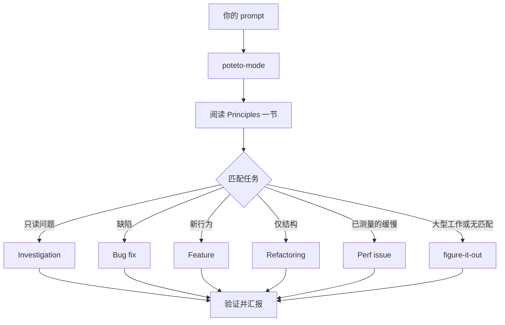

# 通过 `/poteto-mode` 路由工作

`/poteto-mode` 是正门。你给它一个目标，它匹配二十三个 playbook 之一，把该 playbook 的步骤复制进 todo list，并在步骤需要时调用其他 skill。本页教你什么样的 prompt 算好 prompt，以及你实际需要写的其实少得可怜。


## 你的 prompt 会经历什么



图中展示的是常见路由。还有针对这些场景的 playbook：对指标做 hillclimb、诊断 runtime 症状与已捕获 trace、prototype、visual parity、编写和评估 skill、autonomous run、把 PR 或 stack 看护到可合并、交付已验证的 stack、以 autopilot 跑 PR 队列、编排项目级工程、session pickup、安全暂停、multi-phase plan，以及 worktree cleanup。[playbook 目录](../../skills/poteto-mode/playbooks/)里有完整列表。

## 说目标，不说仪式

你不用写 spec。你说哪里不对、或想要什么，再加上任何你已知、能省 agent 时间的信息：

```text
/poteto-mode 重试之后用户收到两条通知。先复现，再修复并验证。
```

这就是一个 Bug fix prompt。"先复现"是真正的约束而不是客气话，playbook 会遵守它。看 todo list 被 Bug fix 的步骤填满。被跳过的步骤会带着 `skip: <reason>` 保持可见。

当对话本身已经带着上下文时，prompt 可以缩到几乎没有。下面这些全都够用：

```text
/poteto-mode do it
```

```text
continue
```

```text
keep going until done
```

短之所以可行，是因为这个 mode 是 sticky 的、playbook 承载了结构。你的话承载意图，skill 承载严谨。

## 用 "new task" 切换任务

长聊天会累积上一个任务的上下文。换主题时，明说：

```text
/poteto-mode new task。搞清楚为什么 logout 之后 cache 条目还在。先别改任何代码。
```

"new task" 告诉 `/poteto-mode` 重新匹配，而不是继续上一个 playbook。"先别改任何代码"把这次固定在 Investigation 上。没有这两个短语，一个正处于 Feature 中途的 mode 容易把你的问题当成该 feature 的下一步。

## 给并行工作配独立 worktree

如果你让多个 agent 对同一个仓库干活，它们会争抢工作树。一开始就要求隔离：

```text
/poteto-mode new task。从 <base> 拉一个全新 worktree，把 parser 改动移植过去。
```

每个任务待在自己的 branch 和 worktree 里，就不会有 agent 踩坏别人的文件。[Opening a PR playbook](../../skills/poteto-mode/playbooks/opening-a-pr.md) 对代码改动本来就在 worktree 里进行，所以大多数时候只有当特定 base 或位置要紧时你才需要说这句。

worktree 会越积越多。磁盘吃紧时，问：

```text
/poteto-mode 是什么在吃我的磁盘？把可以安全剪除的 worktree 剪掉。
```

[Worktree cleanup playbook](../../skills/poteto-mode/playbooks/worktree-cleanup.md) 会按合并状态、未提交工作、以及还有哪些聊天在用它，对每个 worktree 分类。它只删证据允许的，对任何持有未提交工作的会停下来等你拍板。

## 让它继续跑

你要离开时，说清楚什么叫"做完"，然后走人：

```text
/poteto-mode 我要离开一会儿。继续跑，直到迁移检查报告旧调用方为零。记录你的决策。
```

你打算事后审查的工作会经由 [`/figure-it-out`](../../skills/figure-it-out/SKILL.md) 路由——它设计这次运行的各阶段，并维护一份 [`/show-me-your-work`](../../skills/show-me-your-work/SKILL.md) 决策日志。[睡觉时让工作继续跑](./07-overnight.md)讲完整的 overnight 契约。

**陷阱：** 不要在 prompt 里罗列 skill（"先用 /how，然后 /architect，然后 /arena……"）。playbook 已经排好了它们的顺序，手写顺序通常会重排或丢掉 playbook 本来会保留的步骤。只有当你想覆盖某个具体选择时才点名 skill。

完整路由规则见 [`poteto-mode`](../../skills/poteto-mode/SKILL.md) 本体。

下一页：[理解代码](./03-understand.md)。
