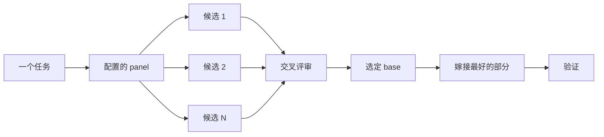

# 写代码之前先设计

对困难设计只试一次，等于把模型想到的第一个形态直接锁死。`/architect` 在实现之前先定好类型和边界；`/arena` 对同一份 brief 跑多次尝试并合并各家最好的部分；`/interrogate` 让其他模型设法攻破结果。当任务是覆盖率而非设计综合时，`/swarm` 把切片或赛跑 fan out 出去并汇总结果。


## 用 `/architect` 定形态

```text
/architect 在写任何代码之前设计 import pipeline。我最关心调用方怎么用它。
```

[`/architect`](../../skills/architect/SKILL.md) 先给自己打地基：对设计会触及的代码跑 `/how`，涉及 ownership 或分层变动时跑 `/why`。然后跑 `/arena` 产出互相竞争的设计草图——每份都先写调用方的用法，再写类型、签名和模块图。

默认它会从综合出的设计直接进入实现。如果你想先看设计，明说：

```text
/architect with checkpoint。实现之前先停下来给我看。
```

## 用 `/arena` fan out 多次尝试

```text
/arena 把我的 prompt 原样带进 arena。我想对比它们的方案和你的。
```

[`/arena`](../../skills/arena/SKILL.md) 是底层通用工具。N 个 subagent 并行尝试同一份设计或代码 brief，各自写进自己的 worktree 或目录。一个只读 judge——在你的配置允许时来自不同模型家族——按 rubric 给每个候选打分。coordinator 把每个候选从头读到尾，选一个 base，把败者最好的想法嫁接进来，然后验证结果。



panel 来自你的 [`/setup-pstack`](../../skills/setup-pstack/SKILL.md) 配置，也可以按任务临时调整。决策重要时要多些候选，不重要就少些：

```text
/arena this，5 个候选。cache key 格式以后再改代价很大。
```

## 用 `/swarm` 覆盖切片与赛跑

```text
/swarm 对照各自的 check.sh 检查 packages/ 下每个包。一个包一个 worker。一份报告。
```

[`/swarm`](../../skills/swarm/SKILL.md) 把 N 个 worker fan out 到相互独立的切片、覆盖矩阵、gauntlet 赛道、探索分区或声明好的 race 分支上。每个 worker 拿到自己的 scope 和 check，然后回报 `PASS`、`ISSUES` 或 `BLOCKED`。父 agent 等 worker 全部返回，给出一份紧凑报告，附上任何缺口或掉队的分支。

当并行能买来覆盖率、或能让相互独立的检查赛跑时用它。`/arena` 给每个 worker 同一份设计或代码 brief，然后选 base 并嫁接最好的部分；`/swarm` 覆盖切片或跑一场事先声明选拔规则的 race，没有选 base 和嫁接那套仪式。

## 用 `/interrogate` 攻破它

```text
/interrogate 整个 branch，但要带着怀疑眼光。除非是真正的 bug 或 regression，否则别挑刺。
```

[`/interrogate`](../../skills/interrogate/SKILL.md) 把同一份 diff、意图和 rubric 发给几个不同模型家族上的 reviewer。模型多样性正是重点：不同模型有不同的盲区，两个模型独立提出的同一个发现是高置信信号。lead 把所有发现分进 `Act on`、`Consider`、`Noted`、`Dismissed` 四档，每条驳回都附理由，且不自动应用任何修改。

驳回项也值得读。lead 是个务实的资深工程师而不是神谕，你可以推翻它。

## 一个任务配得上多少设计工作？

你可能会想是不是每个改动都需要这套。不是。大多数改动一样都不需要。一个粗略的阶梯：

- 一个你已经做完、但心里没底的小改动，单独用 `/interrogate` 就够。
- 跨越函数边界或移动 ownership 的改动，配得上 `/architect`——它会自带 `/arena`。
- 独立决策、多试几次有帮助的那种——比如命名、格式、算法——直接上 `/arena`。
- 覆盖矩阵、一组并行检查、或带声明分支的 race，用 `/swarm`。
- 有争议且逆转代价高的设计，先 `/architect`，交付前再 `/interrogate`。

`/poteto-mode` 已经内置了这套阶梯：跨边界的工作会自行触发 `/architect`。所以你直接调用这些 skill，主要是在你想要比默认更多或更少审查的时候。

下一页：[构建并清理改动](./05-build-and-clean.md)。
