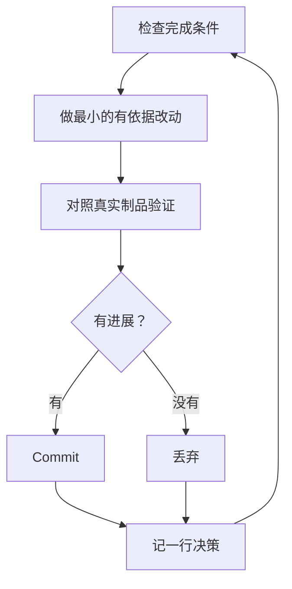

# 睡觉时让工作继续跑

这是前面一切的回报。一个你能信任它会验证自己工作的 agent，才是一个你敢放着它独自啃硬任务的 agent。让这变得安全的不是愿望，而是一个可检查的完成条件、一个隔离的 worktree、和一份你早上审计的决策日志。


## overnight 契约

一次好的交接包含目标、完成条件、权限和一个逃生舱。不需要很长：

```text
/poteto-mode 我要去睡了。在 <base> 上开一个全新 worktree，把每个调用方迁到新 parser。
done 意味着：旧调用方为零、所有 parser fixture 通过、旧 api 已删除。
记一份决策日志。commit 前不用问我。
/loop 直到 done。如果真卡了几小时，停下来写清为什么。
```

逐行看看每句买到什么：

- "我要去睡了"是会话级覆盖：agent 停止提问、持续前进。
- "done 意味着……"把目标变成每次迭代都能跑的检查。
- "在 `<base>` 上开全新 worktree"让这次运行不撞上你开着的其他东西。
- "commit 前不用问我"预先回答了 agent 本来会阻塞等待的许可。
- `/loop` 是 Cursor 内建的唤醒机制，不是 pstack 的 skill。[Autonomous run playbook](../../skills/poteto-mode/playbooks/autonomous-run.md) 用它按事件或心跳复查完成条件。
- 逃生舱让它在真正的死胡同停下来写清原因——这好过八小时对目标的创造性重新诠释。

因为你离开后会审查这项工作，`/poteto-mode` 会把它经由 [`/figure-it-out`](../../skills/figure-it-out/SKILL.md) 路由——在写任何代码之前先设计这次运行的各阶段，并接好决策日志。

## 整夜循环在做什么



每次迭代：一个改动、一次检查、一行日志。没帮上忙的改动被丢弃而不是搭车。平台期意味着 pivot 而不是停手；完成条件永远不会悄悄放松来宣布胜利。

## 早晨审计

[`/show-me-your-work`](../../skills/show-me-your-work/SKILL.md) 让这次运行可审查。每一行记录时间、阶段、决策、理由、证据指针和结果，存在 `decisions.tsv`（多个 run 共享目录时存 `.audit/<task-slug>.tsv`）里。默认保持本地。当工作重大到审查者需要这条轨迹才能信任结果时，把它 commit 进去。

回来之后，让它以审查形式汇报：

```text
/show-me-your-work 给我讲讲你昨晚做了什么
```

skill 交回摘要之前，会先在另一个模型家族上 spawn 一个 reviewer 读轨迹和 transcript，回复末尾带一个 Attention 一节，列出值得你细看的地方。先读那节，再读它指到的日志行。你在审计决策，不是重读整个夜晚。

## 当夜里装的是队列而不是单个任务

上面的契约把一个任务推进到一个完成条件。有些夜晚装得更多：一串相互独立的改动，或一整盘工程。三个 playbook 把同一种信任放大。

[Autopilot-full](../../skills/poteto-mode/playbooks/autopilot-full.md) 把一队相互独立的 PR 跑到合并。每个 PR 配一个 owner agent，从构建一路带到合并，且没有 owner 凭自己的裁决合并。一群全新 verifier 检查每个 merge-ready 的 head，只有干净的裁决才授权合并：

```text
/poteto-mode 对这队任务开 full autopilot。每项相互独立。我要早上之前合并完。
```

[Autopilot-stack](../../skills/poteto-mode/playbooks/autopilot-stack.md) 跑同样的 owner 循环但不交付任何东西。你醒来面对的是一条线性的 base-branch stack，每一环都带 verifier 裁决，由你自己 review 并落地。当改动相互耦合、或你想在合并前亲眼过一遍时，选它不选 Autopilot-full：

```text
/poteto-mode 这五个改动开 autopilot，但堆成 stack、别交付。早上我自己落地。
```

[Orchestrate](../../skills/poteto-mode/playbooks/orchestrate.md) 用于活得比任何单个 agent 都久的工程：跨多天、大量 stacked PR、一个常驻 coordinator chat 之下的 subagent 舰队。coordinator 撰写 brief、收编 subagent 完成的东西、保持最底层未合并 PR 常绿，且自己从不写代码。它是刻意做重的机器。如果一个 agent 一个会话就能干完，playbook 自己也会把你路由回上面的 overnight 契约：

```text
/poteto-mode orchestrate 这次 store 迁移。负责到每个包都转换完并合并为止。我每天来查两次。
```

**陷阱：** 时长不是完成条件。"在这上面干 4 小时"没给 agent 任何可检查的东西，你醒来会得到四小时的动作而不是结果。给 `/loop` 一个能 pass 或 fail 的谓词。

下一页：[用 principle 名字做舵](./08-principles.md)。
